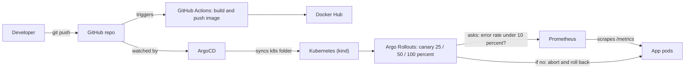

# AutoPilot: GitOps platform with automatic canary rollback

A small web app released through a pipeline that detects a bad release from live metrics and rolls it back automatically, with no human involved.

## The problem

A bad release that goes to all users at once can cause an outage until someone notices and undoes it by hand. This project releases new versions to a small share of traffic first, measures the error rate, and decides by itself whether to continue or roll back.

## Architecture

## Tools used

| Area | Tool |
|---|---|
| Source control | Git, GitHub |
| CI | GitHub Actions |
| Containers | Docker, Docker Hub |
| Orchestration | Kubernetes (kind) |
| GitOps / CD | ArgoCD |
| Progressive delivery | Argo Rollouts (canary) |
| Monitoring | Prometheus |

## How it works

1. A push to `main` triggers GitHub Actions, which builds the Docker image and pushes it to Docker Hub with two tags: `latest` and the commit SHA.
2. ArgoCD watches the `k8s/` folder in this repo and keeps the cluster identical to it (GitOps).
3. The app runs as an Argo Rollout with 4 pods. A new version goes out in steps: 25 percent, then 50 percent, then 100 percent.
4. At each step, an AnalysisTemplate asks Prometheus for the error rate of the new version only. Below 10 percent the rollout continues. Above 10 percent it aborts and the old version stays.
5. A load generator sends steady traffic, so Prometheus always has data to measure.

## The demo

- **Good release (v2):** both analysis checks passed and the rollout completed.
- **Bad release:** I set `ERROR_RATE` to 0.5 in Git, so half the requests fail. The analysis run `Failed` within about a minute, the rollout stopped, and the 4 healthy pods kept serving users.
- I then reverted the commit so Git matches the cluster again.

## What broke and how I fixed it

- **Docker Hub login failed in CI** (`unauthorized`). The token stored in GitHub secrets was wrong. I created a new access token, saved it, and re-ran the pipeline.
- **`kubectl apply` failed with "annotations too long"** for ArgoCD and Argo Rollouts. Their definitions are too big for the normal apply. I used `--server-side`.
- **`kubectl port-forward` died after I deleted a pod.** It attaches to one pod. Real traffic goes through the Service, which switches pods, so I only use port-forward for testing.
- **YAML pasted into an editor lost its indentation.** I wrote the files from the terminal instead.

## Limitations and next steps

- A "release" is simulated with environment variables (`APP_VERSION`, `ERROR_RATE`) in Git instead of building a new image per release.
- Runs on a local kind cluster, not a cloud cluster.
- Next: Terraform for cloud infrastructure, Grafana dashboards, Slack alerts, Trivy image scanning in CI.

## Run it yourself

1. Install Docker Desktop, kind and kubectl. Create the cluster with `kind create cluster --name autopilot`.
2. Install ArgoCD and Argo Rollouts, using `kubectl apply --server-side`.
3. Deploy Prometheus with `monitoring/prometheus.yaml` and `monitoring/prometheus-config.yaml`.
4. Apply `argocd/application.yaml`. ArgoCD then deploys everything in `k8s/`.
